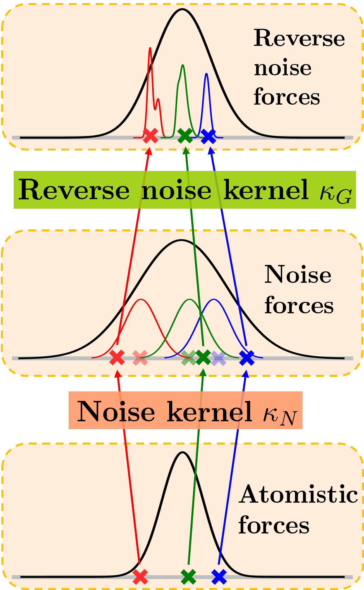

# Operator Forces For Coarse-Grained Molecular Dynamics
----------------------------

This repository contains example code as well as model weights to reproduce the results in our publication *Operator Forces For Coarse-Grained Molecular Dynamics*.

Publication
-----------
Please find the arxiv preprint here: http://arxiv.org/abs/2506.19628

### Abstract
Coarse‐grained (CG) molecular dynamics simulations extend the length and time scale of atomistic simulations by replacing groups of correlated atoms with CG beads. Machine‐learned coarse‐graining (MLCG) has recently emerged as a promising approach to construct highly accurate force fields for CG molecular dynamics. However, the calibration of MLCG force fields typically hinges on force matching, which demands extensive reference atomistic trajectories with corresponding force labels. In practice, atomistic forces are often not recorded, making traditional force matching infeasible on pre-existing datasets. Recently, noise‐based kernels have been introduced to adapt force matching to the low-data regime, including situations in which reference atomistic forces are not present. While this approach produces force fields which recapitulate slow collective motion, it introduces significant local distortions due to the corrupting effects of the noise-based kernel. In this work, we introduce more general kernels based on normalizing flows that substantially reduce these local distortions while preserving global conformational accuracy. We demonstrate our method on small proteins, showing that flow‐based kernels can generate high-quality CG forces solely from configurational samples.



Illustration of the three force‐generation strategies for a single unimodal distribution (e.g., a bond length): **Bottom panel:** Three points sampled from the data distribution. When atomistic forces are available, they can be used directly in subsequent applications. **Middle panel:** Each of the three samples is perturbed by Gaussian noise (noise kernel), broadening the distribution. The original sample points, which now serve as the centers of the Gaussian kernels, are displayed semi-transparent. Forces computed from this noising process correspond to the distorted distribution and thus inherit its local inaccuracies.
**Top panel:** We apply a learned reverse noise kernel (via a conditional flow) to correct the perturbed samples, yielding a distribution closer to the original. Forces derived from this reverse kernel result in fewer local distortion in subsequent applications.

Requirements
------------
[bgflow](https://github.com/noegroup/bgflow) and [timewarp](https://github.com/microsoft/timewarp/tree/main) with their respective dependencies.

Running the Experiments
------------

All scripts for training the flow models and generating CG forces are located in the `src` directory. Below are example commands for the Chignolin system using 10 % of the training data and a noise variance of 0.05:

* **Timewarp coupling flow**
  Trains with 8 RealNVP layers (each with 3 transformer blocks) and then samples forces via the reverse‐noise kernel:

  ```bash
  python src/Timewarp_training_sampling.py CLN 0.05 8 3 10
  ```

* **Continuous normalizing flow (CNF)**
  Trains with both noise and prior variances set to 0.05 and then samples forces via the CNF‐based kernel:

  ```bash
  python src/CNF_training_sampling.py CLN 0.05 0.05 10
  ```

Simply replace `CLN`, the variance values, layer counts, or data‐fraction argument to reproduce experiments on other systems or with different hyperparameters.

Pretrained models
------------
Pretrained models are available in the models folder. 

